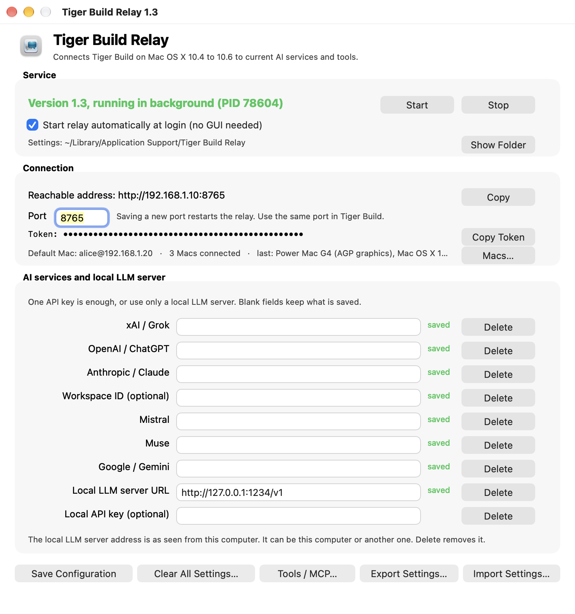
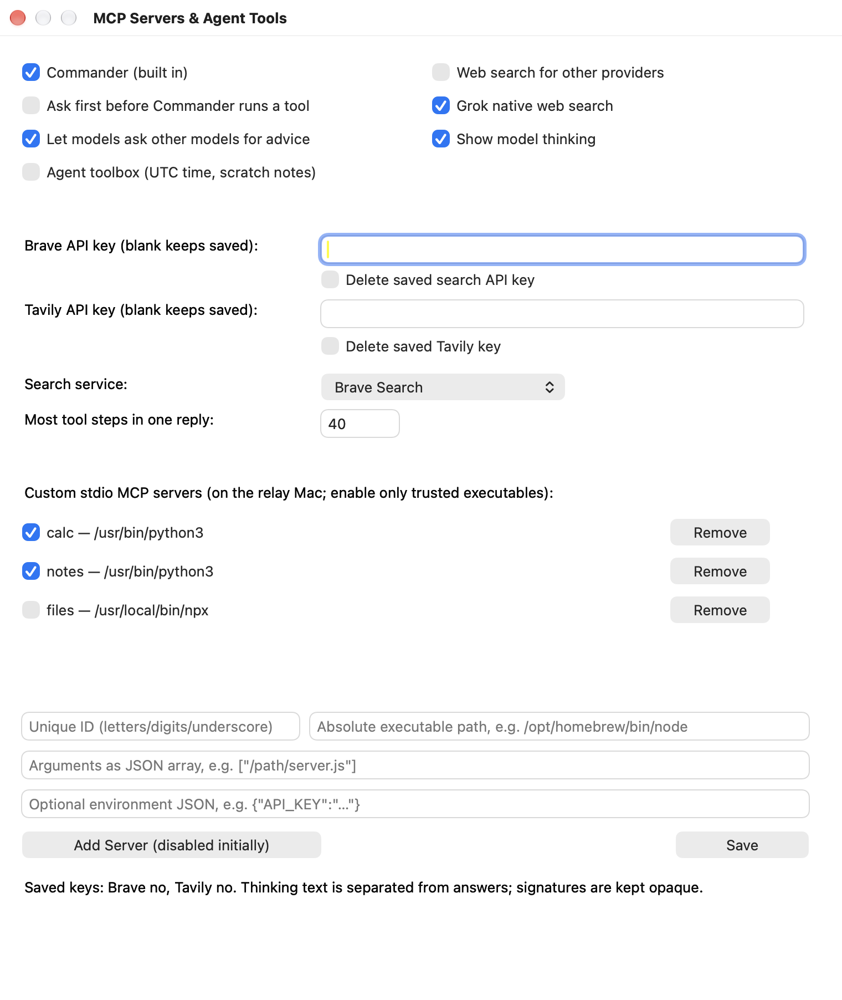
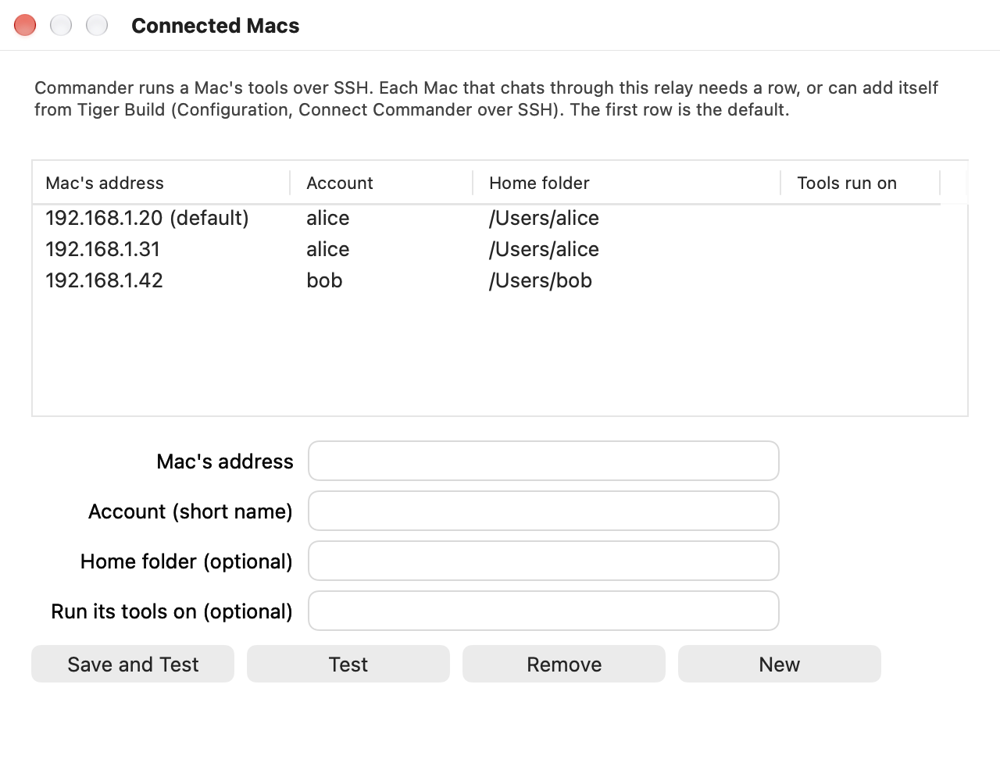

# Tiger Build

**A native AI chat app for Mac OS X 10.4 Tiger, 10.5 Leopard and 10.6 Snow Leopard, on PowerPC and Intel, that can also work on the Mac it runs on.**

Tiger Build is a Cocoa chat window for old Macs. Each chat picks its own service and model: Grok, ChatGPT, Claude, Mistral, Muse, Gemini, or a model on your own local server such as LM Studio. With **Commander** (ppc-commander) on, the model can list folders, read and edit files, run shell commands, use git and Subversion, and take screenshots on that Mac. It keeps its brushed-metal look on Tiger, uses the same layout on Leopard and Snow Leopard, and fits a 1024x768 screen (iMac G3 and up).

> [!WARNING]
> USE THIS AT YOUR OWN RISK. MAC OS X TIGER IS A 20+ YEAR OLD OPERATING SYSTEM AND IS VERY INSECURE. I AM NOT LIABLE FOR ANY SECURITY VULNERABILITIES ABLE TO BE EXPLOITED FROM USING THIS APPLICATION ON TIGER. YOU HAVE BEEN WARNED.

Tiger Build is licensed under the MIT License and comes with no warranty. See [`LICENSE`](LICENSE).

## Screenshots

**The client**, on Mac OS X 10.4 Tiger (PowerPC, brushed metal), 10.5 Leopard (Intel) and 10.6 Snow Leopard (Intel):

| Tiger | Leopard | Snow Leopard |
| --- | --- | --- |
|  |  |  |

**Asking before a tool runs, with the model's thinking shown above the message box while it works** (Stop and Guide replace Send while a reply runs), and **the Tools menu**, which switches each tool on or off for the chat:

| Approval and live thinking | Tools menu |
| --- | --- |
|  |  |

**Preferences** are in tabs so they fit a 1024x768 screen, and **MCP servers** are a list with an edit sheet:

| Commander | Local LLM Server | MCP servers |
| --- | --- | --- |
|  |  |  |

**The relay app** (macOS shown; Windows and Linux have the same settings in a Tk window):

| Relay | Tools and MCP servers | Connected Macs |
| --- | --- | --- |
|  |  |  |

*Screenshots use example addresses, accounts and servers; the token is hidden.*

## Contents

- [Screenshots](#screenshots)
- [How it fits together](#how-it-fits-together)
- [What you need](#what-you-need)
- [Setup](#setup)
- [Where settings are kept](#where-settings-are-kept)
- [Using Tiger Build](#using-tiger-build)
- [Tiger Build Relay app](#tiger-build-relay-app)
- [Models, tools and search](#models-tools-and-search)
- [Security](#security)
- [Troubleshooting](#troubleshooting)
- [Building, testing and packages](#building-testing-and-packages)
- [Upgrading from Tiger Desk](#upgrading-from-tiger-desk)
- [Why Do This?](#why-do-this)

## How it fits together

Tiger cannot open modern HTTPS connections, so Tiger Build never calls an AI service itself. **Tiger Build Relay** runs on a current Mac on the same network. It receives each chat over plain HTTP (protected by a token), calls the AI service, and, when the model wants a tool, runs ppc-commander on the Tiger Mac over SSH.

```
 Tiger Mac (10.4, PowerPC)                  Relay (Mac, Windows, or Linux)
 ┌──────────────────────┐   HTTP + token    ┌───────────────────────────┐   HTTPS   ┌──────────────────┐
 │ Tiger Build.app      │ ────────────────▶ │ Tiger Build Relay         │ ────────▶ │ AI services      │
 │ chats, workspaces    │                   │ keys, model checks, tools │           └──────────────────┘
 └──────────────────────┘                   │                           │   HTTP    ┌──────────────────┐
 ┌──────────────────────┐   SSH (ssh-rsa)   │                           │ ────────▶ │ local server     │
 │ ~/ppc-commander/     │ ◀──────────────── │ runs tools when asked     │           │ (optional)       │
 └──────────────────────┘                   └───────────────────────────┘           └──────────────────┘
```

Chats stay on the Tiger Mac. API keys stay on the relay computer; Tiger Build is only told whether each key is saved.

## What you need

| Where | What |
| --- | --- |
| Client Mac | Mac OS X 10.4 to 10.6, PowerPC or Intel, with its built-in Python (2.3, 2.5 or 2.6) and Remote Login on (System Preferences → Sharing). To build the app yourself: Xcode 2.5 on Tiger, or Xcode 3.1/3.2 on Leopard and Snow Leopard. One universal binary covers `ppc`, `i386`, `ppc64` and `x86_64`; a G5 on Tiger uses the 32-bit part |
| Relay computer | A Mac, Windows PC, or Linux computer that meets the minimums in [Relay system requirements](#relay-system-requirements) |
| Network | The Tiger Mac and the relay computer on the same network, and the Tiger Mac able to reach the relay directly |
| Optional | API keys for xAI, OpenAI, Anthropic, Mistral, Muse or Google (one is enough), a Brave or Tavily key for better web search, and/or a local OpenAI-compatible server |

### Relay system requirements

The relay needs an OpenSSH client 9.1 or later (it enforces `RequiredRSASize=2048`), which sets the minimums below. Intel and ARM64 are both supported.

| Relay computer | Minimum | Also needed |
| --- | --- | --- |
| macOS | macOS 14 Sonoma | Python 3.8 or later (Apple's command line tools provide `/usr/bin/python3`: `xcode-select --install`) |
| Windows | Windows 11 version 24H2 | Python 3.8 or later from python.org, with Tk (the default install includes it). ARM64 PCs can use native ARM64 Python (3.11 or later) or x64 Python |
| Linux | Ubuntu 24.04 or Debian 12 for the `.deb`; other systemd distributions with the same parts can run `scripts/setup.py` | Python 3.8 or later, `python3-tk`, OpenSSH client 9.1 or later |

Older systems ship an older client that cannot reach the Tiger Mac.

You need two pieces of information: the **Tiger Mac's IP address** (System Preferences → Network on that Mac) and the **short user name** of the account on it that will run ppc-commander.

## Setup

All commands run on the **relay Mac**, from a checkout of this repository. Replace `TIGERUSER` and `TIGER.MAC.ADDRESS` with your own values.

> [!TIP]
> Steps 1–3 can be skipped: run `./scripts/setup.sh` (step 4), then on the Tiger Mac choose **Configuration → Connect Commander over SSH** in Tiger Build. It installs the relay's key and tells the relay the address and user name; no password is typed.

**1. Make an SSH key Tiger accepts.** Tiger's OpenSSH 5.1 only understands `ssh-rsa`. Leave the passphrase empty so the relay can start at login.

```bash
mkdir -p ~/.ssh && chmod 700 ~/.ssh
ssh-keygen -t rsa -b 2048 -f ~/.ssh/ppc_tiger_rsa -N "" -C tiger-build
```

**2. Install the public key on the Tiger Mac.** This is the only time you type that account's password. Type `yes` to trust its host key.

```bash
ssh -o HostKeyAlgorithms=ssh-rsa -o PubkeyAcceptedAlgorithms=ssh-rsa \
  -o KexAlgorithms=diffie-hellman-group-exchange-sha256,diffie-hellman-group14-sha1 \
  -o Ciphers=aes256-ctr,aes128-ctr -o MACs=hmac-sha1 \
  -o UserKnownHostsFile="$HOME/.ssh/ppc_tiger_known_hosts" \
  TIGERUSER@TIGER.MAC.ADDRESS \
  'mkdir -p ~/.ssh && chmod 700 ~/.ssh && cat >> ~/.ssh/authorized_keys && chmod 600 ~/.ssh/authorized_keys' \
  < ~/.ssh/ppc_tiger_rsa.pub
```

**3. Tell the relay which Tiger Mac to use.**

```bash
./scripts/setup.sh      # first run only writes config.sh, then stops
open -e ~/Library/Application\ Support/Tiger\ Build\ Relay/config.sh
```

Set `TIGER_HOST` and `TIGER_USER`. Leave the other lines as they are. Check the key login with `ppc-commander/bin/ppc-ssh 'echo ok'`.

**4. Start the relay.** Optionally put API keys in `.env` first (`cp .env.example .env`); you can also add them later in either app.

```bash
./scripts/setup.sh
```

It installs the relay, starts it (and at login), builds **Tiger Build Relay.app** in `~/Applications`, and prints the relay's **address, port and token**. The first start tests each model once, which takes a few minutes.

**5. Install Tiger Build on the Tiger Mac.**

```bash
./scripts/install-tiger.sh
```

This copies ppc-commander to `~/ppc-commander`, builds Tiger Build there, puts it on the desktop, and fills in the relay address and token. `TIGER_SUDO_POLICY=1` also installs the optional `/etc/ppc-commander.json` policy.

Or open **Tiger Build → Preferences**, enter the address, port and token from step 4, and click **Test Connection**. For the installer packages, see [`RELEASE.txt`](RELEASE.txt).

## Where settings are kept

**Relay computer:** `~/Library/Application Support/Tiger Build Relay/` (macOS), `%APPDATA%\Tiger Build Relay` (Windows), `~/.local/share/tiger-build-relay` (Linux). `TIGERBUILD_RELAY_HOME` overrides it, and **Show Folder** in the relay app opens it.

| File | Contents |
| --- | --- |
| `config.sh` | Tiger Mac address and user, SSH key paths, port, `LISTEN_ADDR`, `ALLOWED_CLIENTS`, `RELAY_TOKEN` |
| `providers.json`, `integrations.json` | API keys, local server, tool switches, MCP servers (mode 600) |
| `relay-token` | The token Tiger Build must send (mode 600) |
| `ssh-clients.json` | Which account the relay signs in as for each Tiger Build computer |
| `pricing-cache.json`, `models-cache.json` | Cost prices and model test results |
| `history/`, `media/`, `agent-notes.txt` | History snapshot, generated files, toolbox notes |
| `relay.log`, `app/` | Log and the installed relay code (`app/.env` can seed API keys) |

Start at login is a launchd agent on macOS, a scheduled task (or Startup shortcut) on Windows, and a systemd user service on Linux. Stop stops the relay; turning start-at-login off does not. The SSH key is `~/.ssh/ppc_tiger_rsa`. Program files are in `/usr/local/tiger-build-relay`, `/opt/tiger-build-relay` or `%LOCALAPPDATA%\Tiger Build Relay\package`.

**Tiger Mac:** `~/Library/Application Support/Tiger Build/`

| File | Contents |
| --- | --- |
| `server.txt`, `token.txt` | Relay address and token (mode 600) |
| `chats.plist`, `workspaces/<name>.plist` | Chats and settings per workspace, with `backups/` beside them |
| `attachments/`, `media/` | Attached files, downloaded pictures and files |
| `history-before-import-*.plist` | Backups made before a history import |

Preferences are in `~/Library/Preferences/local.tigerbuild.TigerBuild.plist`, ppc-commander in `~/ppc-commander/`, and the relay's public key in `~/.ssh/authorized_keys`.

## Using Tiger Build

Every menu command has a keyboard shortcut, shown in the menu.

**Chats**
- **Workspaces.** The sidebar popup picks a workspace (project); each has its own chats. API keys and tools are shared. Workspace → Directory Restriction limits Commander to one folder. Clear All History deletes every chat and workspace.
- **Models.** The popups under the chat list pick service and model. A new chat starts with the last chat's model, tools and approvals, or a fixed model chosen in Preferences. Services with no key or no working model are dimmed with the reason.
- **Stop and guidance.** Stop (⌘.) ends a reply at once, even mid-command. While a model uses tools, Send becomes **Guide**: a note typed then reaches the model between steps (Grok, ChatGPT, Claude, Gemini, Mistral).
- **Edit and retry.** Retry resends your last message. Edit Last takes it back into the message box (Cancel Edit restores). Right-click any message for **Edit From Here** or **Branch Chat From Here**.
- **Find in Chats** (⌘F), **Custom Instructions** (⌥⌘T, per chat or per workspace), and **View → Bigger/Smaller Text** (⌥⌘= and ⌥⌘-).
- **Export and import.** Chat → Export This Chat (⌥⌘E) saves one chat with its files, or as Markdown or text; Import Chat (⌥⌘I) adds it to any workspace. History → Export All History covers every workspace; the relay copy and import backups hold references only. Each workspace file keeps five rolling backups.

**Files and replies**
- **Attach** (button, ⇧⌘A, drag onto the chat or Dock icon, or paste). Text, code, PDF, RTF and HTML are read on the Mac. Word, Excel, PowerPoint, Pages, Numbers, Keynote, OpenDocument, HEIC, WebP and AVIF are converted by the relay (text slide by slide or sheet by sheet, plus a preview picture; Pages/Numbers/Keynote text is recovered, not exact). Pictures are shrunk to 1600 pixels and sent to models that can see them; sideways phone photos are turned upright.
  - A PDF that is mostly drawings or a scan also sends its first three pages as pictures; Chat → Attach PDF Pages (⇧⌘P) adds pages you name, such as `7, 10-12`.
  - The first attach for each service explains the files go to that service. A file too big for the model's context is offered shortened. Stop cancels a read in progress.
  - Copies are kept in Application Support and the model is told where, so Commander can use them. Only the last six pictures are re-sent.
- **Files from the model.** The model can hand over a file with a **Save As...** button. A name ending `.docx`, `.xlsx` or `.pdf` makes a real Word, Excel or PDF file. Pictures a tool looks at are shown in the chat.
- **Code blocks.** Dark panels name the language and colour about 40 languages, with **Save** and **Copy**. Replies also show bold, italics, `inline code`, headings, bullets, links and tables. Chat → Copy Last Code Block (⇧⌘C) copies without clicking.
- **Thinking.** Returned reasoning shows in its own card and stays visible above the message box while the model runs (Claude, ChatGPT reasoning models, Grok, Gemini, Mistral Magistral, local reasoning models). Turn it off in Tools settings.
- **Cost and context.** The line above the chat shows context use and an **estimated cost** (hover for the breakdown), from a public price list the relay fetches; local models show N/A. A full context is summarized (also Chat → Compact Chat Now), and a reply that hits the output limit ends with a note.

**Tools**
- **The Tools button** switches each tool on or off for the chat: Commander, the agent toolbox, web search, other models and every MCP server. **Ask Before Running** waits for your answer, for all tools or chosen ones; "Always Allow" turns it off for that tool in that chat. It is on by default for tools that act on the Mac in chats with attachments. Each call shows as a card; click for the command and output.
- **Screenshots.** `take_screenshot` shows the Mac's screen (someone must be logged in); `view_image` shows a picture file. Models without vision are not offered either.
- **Source control.** `repo_info`, `git_read`, `git_write`, `svn_read` and `svn_write` let a model check status, read diffs and logs, and commit. Read tools never ask first; write tools follow Ask Before Running. A diff or commit shows `2 files +3 −0` on its card.
  - Subversion ships with Mac OS X 10.5 and later. git does not (before Lion): install it yourself, for example from MacPorts, and the tools find it.
  - Nothing runs through a shell. Force pushes, deleting remote branches, skipping hooks, passwords on the command line, interactive rebase and commits without `-m` are refused, and paths must stay in the allowed folders. A repository can contain hooks that run code, so use trusted ones.
- **Ask other models.** `consult_model` asks another working model for a second opinion; its usage counts in the chat's cost.
- **Tool steps.** A reply may use up to 40 tool steps (1 to 200 in Tools settings); then the relay stops it and you can say "continue".

**Voice** (optional, off until switched on, under Chat → Voice)
- **Speaking.** Speak Last Reply (⌥⌘S), Stop Speaking (⌥⌘.), Speak Replies Automatically (⇧⌥⌘J) and Choose Voice (⌥⌘V) use the Mac's own voices ("Alex" needs 10.5). Code and tables are not read out.
- **Voice Commands** (⌥⌘G) listens, while Tiger Build is in front, for "Send message", "Stop", "New chat", "Read that again" and "Stop talking".
- **Dictate** (⌥⌘R) records, press again to stop (⌘. cancels), and puts the words in the message box. The relay turns the clip (16 kHz mono, up to 90 seconds) into text with OpenAI, Mistral or Google, whichever has a key, and does not keep it; Tiger Build says so the first time. Send Dictation Automatically (⌥⌘Y) sends it straight away. It needs a working microphone and a relay 1.4 or later.

**Several Macs and windows**
- Commander runs on the Mac you chat from: the relay keeps one SSH link per Tiger Build computer, and a Mac that has not connected gets no Commander rather than another Mac's. Tiger Build offers to connect.
- Windows share each workspace's chats (a chat working in one window cannot be sent to from another). The relay handles requests separately and limits simultaneous SSH logins to one Mac.

**Status and menus**
- A red line at the top says the relay cannot be reached, rejects the token, or does not accept this Mac's address; an orange one says why Commander cannot run, with the fix; a gray one says the app and relay are different versions. Long runs send heartbeats, so slow commands never look like a lost connection.
- **Commander menu:** Start, Stop and Start at Login for ppc-commander, and this Mac's model, OS and addresses. **Configuration menu:** MCP servers and agent tools, Connect Commander over SSH, and export/import of all settings. VoiceOver labels are set on controls and messages.

## Tiger Build Relay app

The Mac app and the Windows and Linux settings windows show whether the relay is running, its address, port and token, the Tiger Mac, start and stop, start at login, API keys and the local server. Closing the window leaves the relay running. **Connected Macs** lists each Mac that chats through the relay, with its account, home folder and where its tools run, and has Add, Save, Test and Remove. A Mac can also be connected from Tiger Build's Preferences (Commander tab) or Configuration → Connect Commander over SSH.

From Terminal, without a window:

```bash
"/Applications/Tiger Build Relay.app/Contents/MacOS/TigerBuildRelay" --start    # or --stop
python3 "$HOME/Library/Application Support/Tiger Build Relay/app/relay/control.py" status|start|stop
```

## Models, tools and search

- **Live model list.** At start and every six hours the relay asks each keyed service for its models, drops non-chat ones, and test-calls each with a tool. Only models that pass are offered; changing a key retests that service.
- **Local LLM server.** None is assumed. Give its address as the relay computer sees it, for example `http://127.0.0.1:1234/v1` for LM Studio on the relay computer.
- **Custom MCP servers.** Add stdio servers (program path, arguments, environment) in the MCP Servers tab of either app; double-click to edit. They run on the relay computer, start disabled, and can be set to ask first. Enable only programs you trust. `relay/http_mcp.py` bridges Streamable HTTP servers.
- **Example servers.** `mcp-examples/` has three dependency-free Python 3 servers: `mcp_calc.py`, `mcp_notes.py` and `mcp_sysinfo.py` (with `slow_task` and `always_fails` for testing Stop). Add one with your Python 3 as the program and the script's full path as the argument. The official servers work too, for example program `/path/to/npx`, arguments `-y|@modelcontextprotocol/server-filesystem|/some/folder`.
- **Web search and pictures.** Search runs on the relay computer. It works with no key (DuckDuckGo, with Wikipedia as a fallback); a Brave or Tavily key broadens it, and a refused key falls back to the free search. Models can find pictures (Brave or Tavily, else Wikimedia Commons) and show them in the chat; the relay downloads them, and only from public addresses. Grok uses its own search while that switch is on.
- **Agent toolbox** adds UTC time and scratch notes. **Claude thinking** passes signed blocks back unchanged, as Anthropic requires.
- **Settings backups.** Export/Import All Settings in either app. Backups hold API keys and the token in plain text; imported MCP servers stay disabled.

## Security

- Every request except `/health` needs the relay token, and only the Tiger Mac and the relay computer may connect. The relay listens on one address.
- SSH uses the strongest settings Tiger's OpenSSH 5.1 supports.
- A model cannot change ppc-commander's blocked commands, allowed folders or shell, or edit its files.
- File conversion refuses XML entity definitions and oversized archives, and the relay deletes the files it hands out after three days.
- With tools on, a model runs shell commands as the Tiger Mac account. The guards stop mistakes and simple tricks, not a determined attacker; use a separate account for real separation.

## Encrypting the connection to the relay

The relay speaks plain HTTP, so chats, attached files and the token cross the network unencrypted (Tiger cannot do modern TLS). To protect them, have the relay computer open an SSH tunnel to the Tiger Mac, as it already does for Commander:

```bash
python3 relay/tunnel.py TIGER-ADDRESS [USER]
```

Leave it running (it reconnects), then set the relay address in Tiger Build's Preferences to `http://127.0.0.1:8765`. It uses the relay's SSH key, so Commander must be set up and Remote Login on. A tunnelled Mac identifies itself with an `X-TigerBuild-Client` header, which the relay believes only from its own computer and only for allowed addresses.

## Troubleshooting

| You see | Try |
| --- | --- |
| "Cannot reach the relay" | Check the address and port in Preferences; on the relay Mac run `curl http://ADDRESS:PORT/health`; allow Python in the macOS firewall |
| "The relay rejected the token" | Copy the token from the relay app into Preferences, or run `install-tiger.sh` again |
| "does not accept this Mac's address" | Add the Tiger Mac's address to `ALLOWED_CLIENTS` in `config.sh`, then run `setup.sh` |
| The orange Commander line, or "tiger mac tools: offline" | The message says why. Usually: choose Configuration → Connect Commander over SSH in Tiger Build, turn on Remote Login, or check the address and user in the relay app. `ppc-commander/bin/ppc-ssh 'echo ok'` must print `ok` |
| A service is dimmed | Add its key, or wait for its models to finish testing |
| Claude asks for `anthropic-workspace-id` | Enter the Workspace ID |

## Building, testing and packages

```bash
python3 -m unittest discover -s relay -p 'test_*.py'      # relay tests
python3 relay/chat_proxy.py --self-test
ppc-commander/bin/ppc-ssh 'cd ~/TigerBuild-build/native && make test'
ppc-commander/bin/ppc-ssh 'cd ~/ppc-commander && python ppc_commander.py --self-test'
```

| Script | Makes |
| --- | --- |
| `scripts/build-pkg.sh` | `dist/TigerBuildRelay-1.4.pkg` (macOS) |
| `scripts/build-deb.sh` | `dist/tiger-build-relay_1.4_all.deb` (Linux) |
| `scripts/build-windows.ps1` or `build-windows-zip.py` | `dist/tiger-build-relay-payload.zip` and `Install-TigerBuildRelay.cmd` (Windows) |
| `scripts/build-tiger-pkg.sh` | `dist/TigerBuild-1.4.pkg` (Tiger Build for the old Macs) |
| `scripts/build-relay-gui.sh` | the Mac relay app |

The macOS package has a universal settings app. The Windows zip and Linux package are source-based and use the platform's Python (3.8+), Tk and OpenSSH. Run setup as your own user, not as administrator. The Windows `.cmd` unpacks the files; then run the setup command it shows. `/health` reports the version. What was tested, and on which Macs, is in [`docs/RELEASE-REVIEW.md`](docs/RELEASE-REVIEW.md).

## Upgrading from Tiger Desk

`scripts/setup.sh` stops the old relay, moves `~/Library/Application Support/TigerDesk` to `Tiger Build Relay` (keys, token and history included), rewrites the launchd job and replaces `Tiger Desk.app`. The same token keeps working, and old settings backups still import.

## Why Do This?

This is just a project for fun.  I saw people creating similar chat environments for older operating systems like Windows 95 and decided to give this a try myself.  As far as I can tell at the time of writing, this is the only LLM chat app for PowerPC Mac OS X that supports interaction with the system itself and is not just a chat interface only.  This app was made with heavy LLM support from Grok Build and Claude Code (with a little bit of ChatGPT) for fun so don't expect perfection.  However, I think it's actually a decently cromulent LLM chat build environment.  Don't expect any future updates or support for this.  I might add some but no promises.  Feel free to suggest improvements.  As stated above, Mac OS X Tiger is a very old operating system with security vulnerabilities, use at your own risk.
