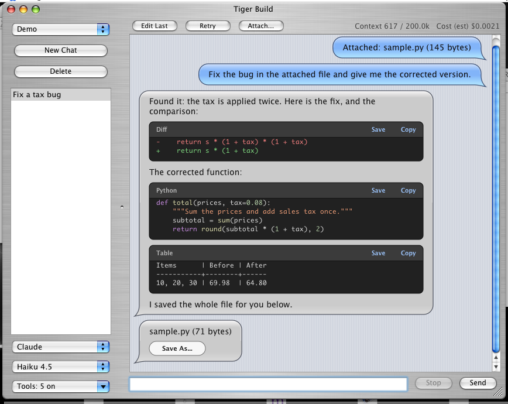
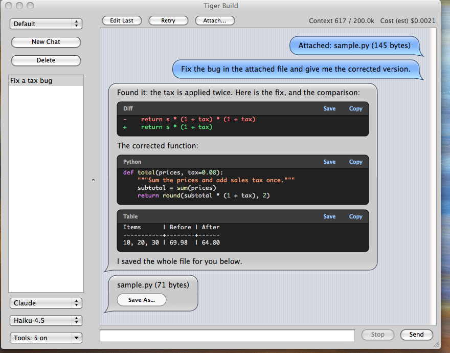
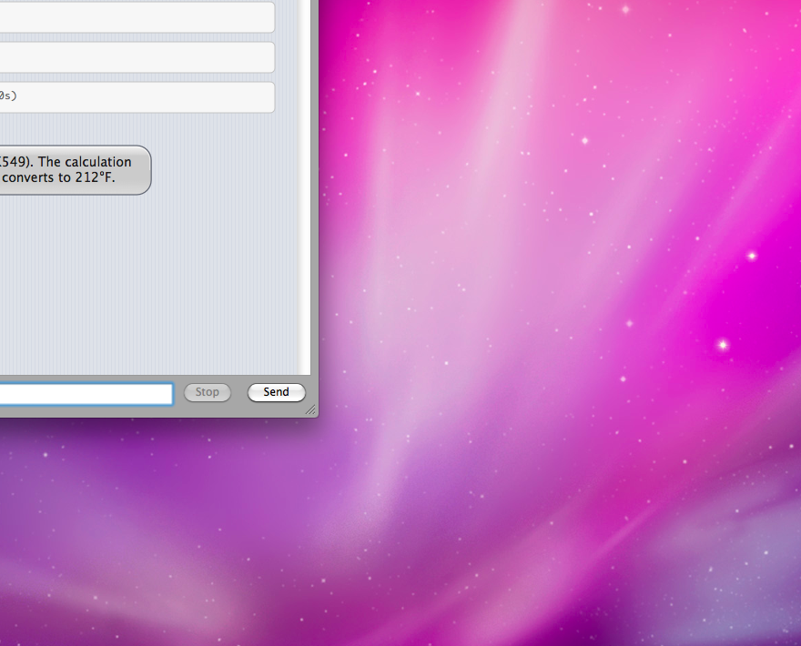
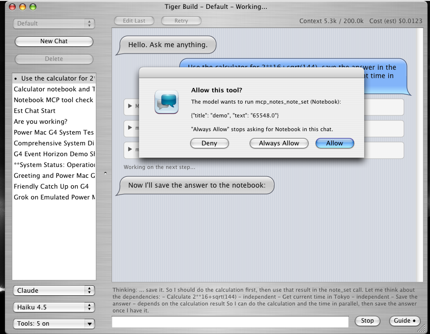
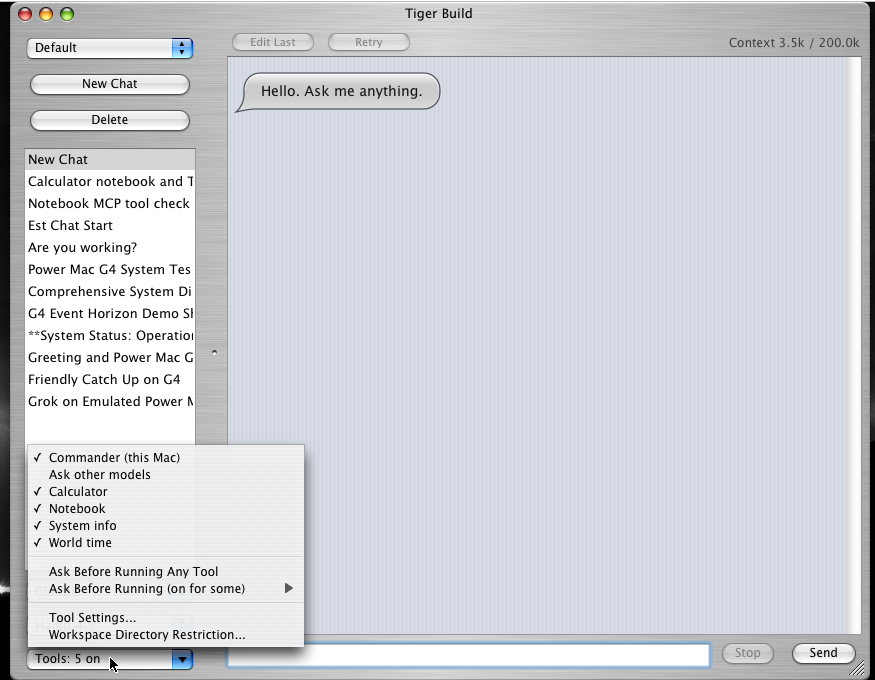
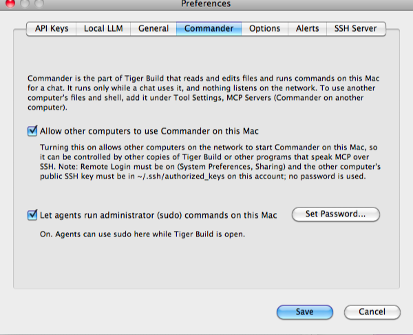
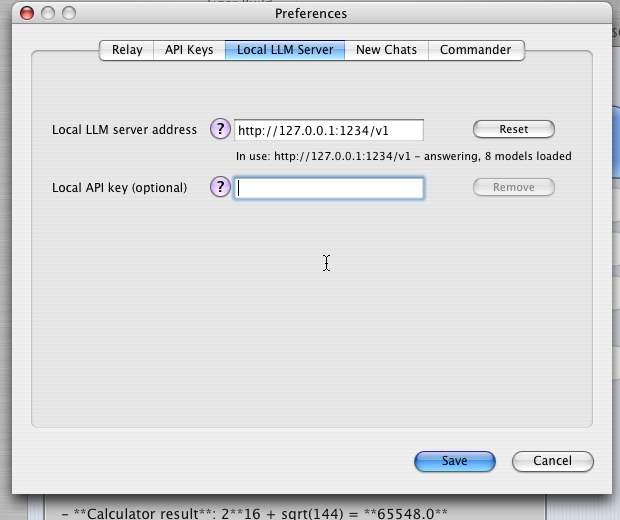
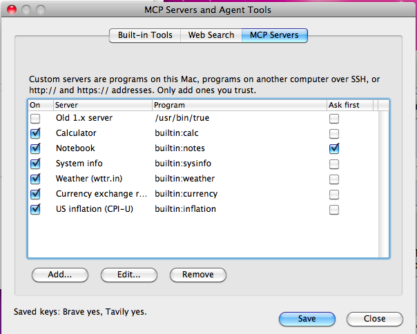
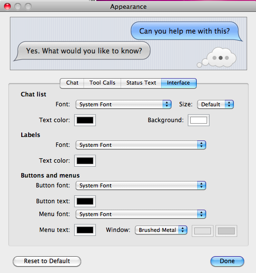

# Tiger Build

**A native AI chat app for Mac OS X 10.4 Tiger, 10.5 Leopard and 10.6 Snow Leopard for PowerPC and Intel.**

Tiger Build is a Cocoa chat window for old Macs. It talks to the AI services directly, over TLS 1.3 and 1.2 that it brings with it, so **no other computer is needed**. It has support for a broad range of providers including: Grok, ChatGPT, Claude, Mistral, Muse, Gemini, and local LLM servers. With **Commander** on (a small native program inside the app), the model can list folders, read and edit files, run shell commands, use git and Subversion, and take screenshots on that Mac. Tiger Build is also designed to look right at home on these older Macs
and uses a UI that is mostly period accurate for the OSes it's operating on. It's almost like a glance into an alternate reality where the
LLM revolution occured around 2009 instead of the 2020s.

> [!WARNING]
> USE THIS AT YOUR OWN RISK. MAC OS X TIGER, LEOPARD, AND SNOW LEOPARD ARE A 15+ YEAR OLD OPERATING SYSTEMS AND ARE VERY INSECURE. I AM NOT LIABLE FOR ANY SECURITY VULNERABILITIES ABLE TO BE EXPLOITED FROM USING THIS APPLICATION ON THESE MACHINES. YOU HAVE BEEN WARNED. SAFEGUARDS HAVE BEEN INCLUDED THOUGH AS MUCH AS IS FEASIBLE WITHIN THE CONFINES OF THE LIMITATIONS OF ITS OPERATING ENVIRONMENT.

Tiger Build is licensed under the MIT License and comes with no warranty. See [`LICENSE`](LICENSE). Secure connections use [Mbed TLS](https://github.com/Mbed-TLS/mbedtls) (Apache-2.0) and the Mozilla CA certificate list (MPL-2.0); WebP pictures use [libwebp](https://chromium.googlesource.com/webm/libwebp) (BSD-3-Clause), AVIF pictures use the decoder of [libaom](https://aomedia.googlesource.com/aom/) (BSD-2-Clause with a patent grant), and HEIC pictures use [libde265](https://github.com/strukturag/libde265) (LGPL-3.0, built as a separate library in `Contents/Frameworks` so it can be replaced). The emoji pictures are [Twemoji](https://github.com/jdecked/twemoji), copyright Twitter, Inc. and other contributors, under [CC-BY 4.0](tiger-build/Emoji-LICENSE.txt).

## Screenshots

**The client**, on Mac OS X 10.4 Tiger, 10.5 Leopard, and 10.6 Snow Leopard:

| Tiger | Leopard | Snow Leopard |
| --- | --- | --- |
|  |  |  |

**Asking before a tool runs, with the model's thinking shown above the message box while it works** (Stop and Guide replace Send while a reply runs), and **the Tools menu**, which switches each tool on or off for the chat:

| Approval and live thinking | Tools menu |
| --- | --- |
|  |  |

**Preferences** are in tabs so they fit a 800x600 screen (iBook G3 Clamshell), and **MCP servers** are a list with an edit sheet:

| Commander | Local LLM Server | MCP servers |
| --- | --- | --- |
|  |  |  |

**Appearance** (Tiger Build menu) changes the chat, tool-call boxes, status text and interface, and the window look (brushed metal, gray, pinstripes, gradient or a solid colour), with a live sample on top:



*Screenshots use example addresses, accounts and servers.*

## Contents

- [Screenshots](#screenshots)
- [How it works](#how-it-works)
- [What you need](#what-you-need)
- [Setup](#setup)
- [Where settings are kept](#configuration-and-setting-file-locations-and-content)
- [Using Tiger Build](#using-tiger-build)
- [Models, tools and search](#models-tools-and-search)
- [Security](#security)
- [Troubleshooting](#troubleshooting)
- [Building, testing and packages](#building-testing-and-packages)
- [Upgrading from 1.x](#upgrading-from-1x)
- [Why Do This?](#why-do-this)

## How it works

Tiger Build 2.0 does everything itself. Version 1.x needed a **relay** on a newer computer because Tiger and the Leopards cannot open modern HTTPS connections; 2.0 carries its own TLS (Mbed TLS 3.6 with the Mozilla certificate list), tested on PowerPC and Intel from Tiger to Snow Leopard. The app calls each AI service, runs the tool loop, converts attached files, transcribes speech, makes pictures (Grok, ChatGPT, Gemini, Muse) and videos (Grok and Gemini; OpenAI closed its video API in September 2026), and starts Commander (and any MCP servers you add) when a chat needs them. There is no Python, no relay and no service to switch on. The basic operation can be seen in the diagram below:

```
 Your Mac (10.4 to 10.6, PowerPC or Intel)
 ┌──────────────────────────────────────────────┐   TLS 1.3 / 1.2   ┌──────────────────────┐
 │ Tiger Build                                  │ ────────────────▶ │ AI services          │
 │  chats, tool loop, keys (Keychain), file     │                   │ (the ones you have   │
 │  conversion, dictation, MCP client           │   HTTP            │  keys for)           │
 │                                              │ ────────────────▶ │ Local LLM server     │
 │  ┌──────────────────────┐                    │                   │ (if configured)      │
 │  │ Commander (in the    │ ◀─ starts with a   │   SSH (optional)  ┌──────────────────────┐
 │  │ app), local only     │    chat that uses  ─────────────────────▶ │ Another Mac running  │
 │  └──────────────────────┘    it              │                   │ Tiger Build, as an   │
 └──────────────────────────────────────────────┘                   │ MCP server           │
                                                                    └──────────────────────┘
```

Your chat history stays on the Mac. API keys are kept in that Mac's Keychain and sent only to the service they belong to.

## What you need

| Where | What |
| --- | --- |
| The Mac | Mac OS X 10.4 to 10.6, PowerPC or Intel. To build the app yourself: Xcode 2.5 on Tiger, or Xcode 3.1/3.2 on Leopard and Snow Leopard. It's generated as a universal binary that covers `ppc`, `i386`, `ppc64` and `x86_64`; ppc64 is only supported on Leopard due to OS API limitations. Newer versions of Mac OS X are theoretically supported since this app does include 64 bit Intel support. It is strongly recommended that you install the Developer Tools disc and/or the appropriate version of Xcode for your system even if you aren't compiling Tiger Build yourself, to let your agents take full advantage of your Mac's capabilities. |
| Network | Internet access to the services you use. The first connection to each service takes a moment on a PowerPC Mac (about 0.2 s for the TLS handshake on a G4). |
| Optional | API keys for xAI, OpenAI, Anthropic, Mistral, Muse, or Google (as few or as many as you want to configure), a Brave or Tavily key for better web search, a local OpenAI-compatible model server (LM Studio, Ollama), and another Mac running Tiger Build (with Remote Login and *Allow Other Computers* on) if you want a chat to use that Mac's files and shell too. |

## Setup

**1. Install.** Open `TigerBuild-2.0.pkg` (or build it yourself, below). It installs Tiger Build in `/Applications`; Commander is inside the app, so nothing else is installed and no sharing service is turned on.

**2. Add keys.** Open **Tiger Build → Preferences**. On the **API Keys** tab paste a key for each service you use, then Save. Keys go to the Keychain; Tiger Build only shows whether one is saved. For LM Studio or Ollama, enter its address on the **Local LLM Server** tab (it can be another computer on your network).

That's it. **Optional:** to use another Mac's files and shell from a chat, run Tiger Build there, choose Commander → Allow Other Computers, and on this Mac add it under Tool Settings → MCP Servers → Add → *Commander on another computer (SSH)* (Copy Key, Trust Host, Test).

**Building it yourself.** On the Mac, in the checkout:

```bash
cd tiger-build
make            # TigerBuild.app, with the slices your Xcode supports
make test       # unit tests
```

## Configuration and Setting File Locations and Content

Everything is on the Mac. API keys, the search keys and the custom MCP server list (which can hold tokens) are in the **login Keychain** under "Tiger Build API keys". The rest:

**`~/Library/Application Support/Tiger Build/`**

| File | Contents |
| --- | --- |
| `chats.plist`, `workspaces/<name>.plist` | Chats and settings per workspace, with `backups/` beside them |
| `attachments/`, `media/` | Attached files, and pictures, videos and files the model made |
| `ssh/` | The key and trusted host list for MCP servers on other computers (only if you set that up) |
| `commander/` | Commander's settings, tool history and the files that say whether Commander is stopped or other computers are allowed |
| `notes-data.json`, `agent-notes.txt` | The example notebook server and the toolbox notes |
| `history-before-import-*.plist` | Backups made before a history import |

Preferences are in `~/Library/Preferences/local.tigerbuild.TigerBuild.plist`.

Note: Pricing estimates on model usage are provided as a convenience and may not always be accurate. Check the usage directly on the provider's API dashboard for the actual numbers.

## Using Tiger Build

Skip this section if you don't want an ultra detailed description of this app's functionality.

**Chats**
- **Workspaces.** The sidebar popup picks a workspace (project); each has its own chats. API keys and tools are shared. Workspace → Directory Restriction limits Commander's file tools to one folder and checks the paths in shell commands; the shell check is a guard against mistakes, not a sandbox, because a shell can always build a path another way. Only give Commander to models and documents you trust.
- **Chat list.** Hover a chat to see its full title. Each service shows its own icon in the provider popup and the Model menu.
- **Models.** The popups under the chat list pick service and model. A new chat starts with the last chat's model, tools and approvals, or a fixed model chosen in Preferences. Services with no key or no working model are dimmed with the reason.
- **Stop and guidance.** Stop (⌘.) ends a reply at once, even mid-command. While a model uses tools, Send becomes **Guide**: a note typed then reaches the model between steps (Grok, ChatGPT, Claude, Gemini, Mistral).
- **Edit and retry.** Retry resends your last message. Edit Last takes it back into the message box (Cancel Edit restores). Right-click any message for **Edit From Here** or **Branch Chat From Here**.
- **Appearance** (Tiger Build → Appearance, ⌥⌘K), in four tabs. **Chat**: as in iChat, the bubble colour, text colour and font for your messages and for replies, and a solid colour, gradient or picture behind the chat. **Tool Calls**: font, text colour and box colour of the cards that show each tool run. **Status Text**: font, colour and an optional shadow or glow for the words outside the bubbles ("Working on the next step..."). **Interface**: font and colours for the chat list, labels, buttons and menus, and the window's look (brushed metal, plain gray, pinstripes, a gradient or a colour). Changes show at once; Reset to Default restores the original look. Settings windows stay in front of the chat. While a reply has not started, a thought cloud with three moving dots shows, like iChat's typing indicator.
- **Find in Chats** (⌘F), **Custom Instructions** (⌥⌘T, per chat or per workspace), and **View → Bigger/Smaller Text** (⌥⌘= and ⌥⌘-).
- **Export and import.** Chat → Export This Chat (⌥⌘E) saves one chat with its files, or as Markdown or text; Import Chat (⌥⌘I) adds it to any workspace. History → Export All History covers every workspace; exports and import backups hold references only. Each workspace file keeps five rolling backups.

**Files and replies**
- **Attach** (button, ⇧⌘A, drag onto the chat or Dock icon, or paste). Text, code, PDF, RTF and HTML are read on the Mac. Word, Excel, PowerPoint (both the modern `.docx`, `.xlsx`, `.pptx` and the old `.doc`, `.xls`, `.ppt`), Pages, Numbers, Keynote, OpenDocument, HEIC, WebP (animated too, up to four frames) and AVIF are converted by Tiger Build itself (text slide by slide or sheet by sheet, plus a preview picture; Pages/Numbers/Keynote text is recovered, not exact; old Office files give text only). HEIC (iPhone photos) is decoded with libde265, which sits in the app as its own library; AVIF uses libaom's AV1 decoder, which takes a few seconds for a big picture on a G4. Pictures are shrunk to 1600 pixels and sent to models that can see them; sideways phone photos are turned upright.
  - A PDF that is mostly drawings or a scan also sends its first three pages as pictures; Chat → Attach PDF Pages (⇧⌘P) adds pages you name, such as `7, 10-12`.
  - The first attach for each service explains the files go to that service. A file too big for the model's context is offered shortened. Stop cancels a read in progress.
  - Copies are kept in Application Support and the model is told where, so Commander can use them. Only the last six pictures are re-sent.
- **Files from the model.** The model can hand over a file with a **Save As...** button. A name ending `.docx`, `.xlsx` or `.pdf` makes a real Word, Excel or PDF file. Pictures a tool looks at are shown in the chat.
- **Emoji.** Macs before Lion have no emoji font, so Tiger Build draws each emoji as a colour picture from the Twemoji set (flags, skin tones and joined emoji too). The chat list shows them too, and copying selected text copies the emoji themselves. Lion and later use the system's own.
- **Code blocks.** Dark panels name the language and colour about 40 languages, with **Save** and **Copy**. Replies also show bold, italics, `inline code`, headings, bullets, links and tables. Chat → Copy Last Code Block (⇧⌘C) copies without clicking.
- **Thinking.** Returned reasoning shows in its own card and stays visible above the message box while the model runs (Claude, ChatGPT reasoning models, Grok, Gemini, Mistral Magistral, local reasoning models). Turn it off in Tools settings.
- **Cost and context.** The line above the chat shows context use and an **estimated cost** (hover for the breakdown), from a public price list Tiger Build fetches once a day; local models show N/A. A full context is summarized (also Chat → Compact Chat Now), and a reply that hits the output limit ends with a note.

**Tools**
- **The Tools button** switches each tool on or off for the chat: Commander, **Administrator (sudo) for Commander** (turning it on turns Commander on, and asks for the account password once), the agent toolbox, web search, other models and every MCP server. **Ask Before Running** waits for your answer, for all tools or chosen ones; "Always Allow" turns it off for that tool in that chat. It is on by default for tools that act on the Mac in chats with attachments. Each call shows as a card; click for the command and output.
- **Screen control.** The Tools menu has **Screen control (mouse and keyboard)**, off for each chat and asking before every use: after `take_screenshot` a model can click, drag, scroll, type and press keys (`screen_click`, `screen_move`, `screen_drag`, `screen_scroll`, `screen_type`, `screen_key`, `screen_info`), using the screenshot's pixel positions. Keys follow the US layout. It acts on whatever is on the screen, so watch it: a model can type into the wrong window.
- **Commander Options** (Preferences): **commands to block** on top of the built-in ones (checked by the words of a command, so it stops mistakes, not a determined attempt), **a diff** in the result of every file write or edit, and, only while Allow Other Computers is on, **Open Tiger Build at login, hidden** (a normal Login Item in System Preferences, Accounts; turning Allow Other Computers off removes it).
- **Screenshots.** `take_screenshot` shows the Mac's screen (someone must be logged in); `view_image` shows a picture file. Models without vision are not offered either.
- **Source control.** `repo_info`, `git_read`, `git_write`, `svn_read` and `svn_write` let a model check status, read diffs and logs, and commit. Read tools never ask first; write tools follow Ask Before Running. A diff or commit shows `2 files +3 −0` on its card.
  - Subversion ships with Mac OS X 10.5 and later. git does not (before Lion): install it yourself, for example from MacPorts, and the tools find it.
  - Nothing runs through a shell. Force pushes, deleting remote branches, skipping hooks, passwords on the command line, interactive rebase and commits without `-m` are refused, and paths must stay in the allowed folders. A repository can contain hooks that run code, so use trusted ones.
- **Ask other models.** `consult_model` asks another working model for a second opinion; its usage counts in the chat's cost.
- **Download tool.** Off by default (Tool Settings → Web Search, then the per-chat Tools menu item). A model may download a file over https only (certificate checked, public addresses, 50 MB limit); you are asked first, and it lands in the chat's files.
- **Tool steps.** A reply may use up to 40 tool steps (1 to 1000 in Tools settings; 0 turns the limit off, at your own risk); then Tiger Build stops it and you can say "continue".

**Voice** (optional, off until switched on, under Chat → Voice)
- **Speaking.** Speak Last Reply (⌥⌘S), Stop Speaking (⌥⌘.), Speak Replies Automatically (⇧⌥⌘J) and Choose Voice (⌥⌘V) use the Mac's own voices ("Alex" needs 10.5). Code and tables are not read out.
- **Voice Commands** (⌥⌘G) listens, while Tiger Build is in front, for "Send message", "Stop", "New chat", "Read that again" and "Stop talking".
- **Dictate** (⌥⌘R) records, press again to stop (⌘. cancels), and puts the words in the message box. The clip (16 kHz mono, up to 90 seconds) goes to OpenAI, Mistral or Google, whichever has a key, and is not kept; Tiger Build says so the first time. Send Dictation Automatically (⌥⌘Y) sends it straight away. It needs a working microphone.

**Several Macs and windows**
- Commander runs on the Mac you chat from. To let a chat use another Mac, add that Mac as an MCP server over SSH (Tool Settings → MCP Servers → *Commander on another computer*); the other Mac must allow it (Commander → Allow Other Computers). Windows share each workspace's chats (a chat working in one window cannot be sent to from another).

**Status and menus**
- A red line at the top says what is wrong with the service you picked (no key, not reachable); an orange one says why Commander cannot run, with the fix. Long runs show their progress, so slow commands never look like a lost connection.
- **Commander menu:** Start and Stop, **Allow Other Computers** (off by default: with it off, only Tiger Build on this Mac can use Commander), and this Mac's model, OS and addresses. **Configuration menu:** MCP servers and agent tools, and export/import of all settings. VoiceOver labels are set on controls and messages.

## Models, tools and search

- **Live model list.** At start and every six hours Tiger Build asks each keyed service for its models, drops non-chat ones, and test-calls each with a tool. Only models that pass are offered; changing a key retests that service. This means this app will theoretically always have
the latest and greatest models available for you to use, excluding API updates that break compatibility. The more powerful models tend to do a much better job of working within the confines of the old OS environments than the less powerful ones.
- **Local LLM server.** None is assumed. Give its address: `http://127.0.0.1:1234` for LM Studio or `http://127.0.0.1:11434` for Ollama (`/v1` is added if left off). Tiger Build reads each model's context length from the server. With Ollama, set its context length in Ollama's settings; the default can be small, and Ollama then drops the oldest part of a long chat without saying so.
- **Custom MCP servers.** Add a program that runs on the Mac (path, arguments, environment), a program on **another computer over SSH** (user@address and the command to run there, using Tiger Build's own key and a host list you confirm), or an `http://` or `https://` address of a Streamable HTTP server (a token goes in the environment as `MCP_AUTH_TOKEN`) in Configuration → MCP Servers and Agent Tools; double-click to edit. Each server can have a **description** for the model: what it is for, or extra instructions, added to each of its tools. They can be set to ask first, and plain `http://` is only allowed on your own network. Enable only servers you trust. OAuth and the older SSE transport are not supported.
- **Example servers.** The first launch adds built-in servers: a calculator and unit converter, a notebook, system info (host, displays, disk space, time; with `slow_task` and `always_fails` for testing Stop), weather from wttr.in, currency exchange rates (Frankfurter, with open.er-api.com as a second source) and US inflation (built-in CPI-U yearly averages from 1913, with the latest months from the Bureau of Labor Statistics). New built-in servers arrive switched off after an update; removing one sticks. They need no Python; remove or switch off any you do not want and it stays that way. Any program that speaks MCP over standard input and output works as a server of your own. The official servers work too, for example program `/path/to/npx`, arguments `-y|@modelcontextprotocol/server-filesystem|/some/folder`.
- **Web search and pictures.** It works with no key (DuckDuckGo, with Wikipedia as a fallback); a Brave or Tavily key broadens it, and a refused key falls back to the free search. Models can find pictures (Brave or Tavily, else Wikimedia Commons) and show them in the chat; Tiger Build downloads them, and only from public addresses. Grok uses its own search while that switch is on, and Gemini can search with Google (Grounding with Google Search, answers come back with their sources; the switch is in Tool Settings, and it falls back to the ordinary search if Google refuses).
- **Agent toolbox** adds UTC time and scratch notes. **Claude thinking** passes signed blocks back unchanged, as Anthropic requires in their more recent updates for 5.5 and later models.
- **Settings backups.** Export/Import All Settings. Backups hold API keys in plain text; imported MCP servers stay disabled.

## Security

- Connections to the AI services use TLS 1.3 or 1.2 and check the server's certificate against the Mozilla list that ships in the app; there is no option to skip the check. Keys are in the Keychain and go only to the service that owns them.
- A model cannot change Commander's blocked commands, allowed folders or shell, or edit its files.
- **Commander is local only.** It starts as part of a chat on the same Mac and nothing listens on the network. Another computer can use it over SSH only if you turn on Commander → Allow Other Computers, which also needs Remote Login in System Preferences and the other computer's public key in that account's `~/.ssh/authorized_keys` (Tiger Build never uses a password); otherwise the program refuses to run for it.
- File conversion refuses XML entity definitions and oversized archives. A model can only fetch pictures from public web addresses, never from your own network.
- **Programs on other computers** (an MCP server over SSH, such as another Mac's Commander) use a key only Tiger Build knows (`ssh/` in Application Support) and a host list you confirm by fingerprint; if that computer's key ever changes, Tiger Build refuses to connect. Tiger's OpenSSH can only make RSA keys, which a recent macOS must be told to accept.
- **Administrator (sudo) mode** is off. To let agents run commands as root on a Mac, open Preferences, Commander, tick *Let agents run administrator (sudo) commands*, and type the account password once. Tiger Build checks it and keeps it in that Mac's Keychain, where only Tiger Build can read it. Commander cannot open that Keychain item, so when a command contains `sudo`, it asks the running Tiger Build for the password over a socket only that account can use, and gives it to sudo through a pipe that is closed before the model's command starts. A chat can use sudo only when its Tools menu has the sudo item ticked (which turns Commander on); the Preferences setting saves the password and the setting for other uses of the program. It works only for Commander on this Mac. The model never sees it, but it runs as the same account, so with sudo on it can do anything root can. `Tiger Build.app/Contents/Resources/ppc-commander --sudo on|off|status` does the same from a terminal, and a root-owned `/etc/ppc-commander.json` containing `{"sudoMode": false}` keeps it off. Blocked commands such as `shutdown` stay blocked under sudo, the approval question marks sudo commands, and `sudo` is refused with `detach`. The login keychain must be unlocked, so stay logged in.
- **How sudo is kept apart between chats and computers.** The password is handed over only against a key. Each Commander that Tiger Build starts for a chat with the sudo item ticked gets its own random key, sent over its standard input (not its environment or arguments, which other programs of the account can read) and valid only while that Commander runs; a chat without the item has no key, so a model there cannot get the password whatever else is open (several chats can differ, each has its own Commander). New chats never start with sudo, download or screen control ticked. **Other computers** can use sudo on this Mac only if you tick *Let other computers run administrator (sudo) commands here* in Preferences, Commander Options (needs Allow Other Computers and the saved password) and copy this Mac's key (**Copy Key**, kept in the Keychain) into the server's Environment on that computer as `TB_SUDO_KEY=...`; that computer sends it, again over standard input, only for chats that have the sudo item ticked. This Mac's own chats are unaffected by that setting either way. Anyone who has this Mac's key and an SSH login can use sudo here, so treat the key like a password.
- With tools on, a model runs shell commands as your account. The guards stop mistakes and simple tricks, not a determined attacker; use a separate account for real separation.

## Troubleshooting

| You see | Try |
| --- | --- |
| "No usable service configured" | Open Preferences and add a key, or the address of a local LLM server |
| "Certificate ... not trusted" or a failed handshake | Check the Mac's date and time (a wrong clock fails every certificate), then try again |
| A service is dimmed | Add its key, or wait for its models to finish testing |
| The orange Commander line, or "tools are offline" | The message says why. Usually Commander was stopped (Commander → Start), or for another computer: Remote Login is off, Allow Other Computers is off there, the key is not in its `authorized_keys`, or the host is not trusted yet |
| Claude asks for `anthropic-workspace-id` | Enter the Workspace ID |
| The first reply is slow on a PowerPC Mac | The first connection to a service does a TLS handshake (about 0.2 s on a G4); later ones are quicker |

## Building, testing and packages

```bash
cd tiger-build && make test                   # unit tests on the Mac you build on
sh tests/engine/run-host.sh                   # engine tests against mock services (run on a current Mac)
```

| Script | Makes |
| --- | --- |
| `scripts/build-tiger-pkg.sh` | `dist/TigerBuild-2.0.pkg` (the installer for the old Macs) |
| `third_party/mbedtls/fetch.sh`, `build-mac.sh` | The TLS libraries (already built and kept in git) |
| `third_party/libwebp/fetch.sh`, `build-mac.sh` | The WebP decoder (already built and kept in git) |
| `third_party/libde265/fetch.sh`, `old-compilers.patch`, `build-mac.sh` | The HEIC video decoder as a dynamic library, patched for the old compilers (already built and kept in git) |
| `third_party/libaom/fetch.sh`, `build-mac.sh` | The AV1 decoder for AVIF pictures, plain C (already built and kept in git) |
| `commander/Makefile` | Commander, built with the app (`make host` builds it for the Mac you are on) |
| `scripts/make-prices.m`, `make-icns.m`, `pack-emoji.c`, `scan-secrets.sh` | Small helpers: the price list, the icon, the emoji pack, and a check that a package holds no keys (each file says how to build it) |

## Upgrading from 1.x

Install 2.0 over 1.x. The relay is not used any more: stop it and remove it if you like. To bring your keys across, export the relay's settings once (Tiger Build 1.x: Configuration → Export All Settings, or the relay's own backup) and choose Configuration → Import All Settings in 2.0; the keys go to the Keychain and MCP servers come back switched off. Your chats are unchanged.

## Why Do This?

This is just a project for fun.  I saw people creating similar chat environments for older operating systems like Windows 95 and decided to give this a try myself.  As far as I can tell at the time of writing, this is the only LLM chat app for PowerPC Mac OS X that supports interaction with the system itself and is not just a chat interface only.  This app was made with heavy LLM support from Grok Build and Claude Code (with a little bit of ChatGPT) for fun so don't expect perfection.  However, I think it's actually a decently cromulent LLM chat build environment.  Don't expect any future updates or support for this.  I might add some but no promises.  Feel free to suggest improvements.  As stated above, Mac OS X Tiger is a very old operating system with security vulnerabilities, use at your own risk.
